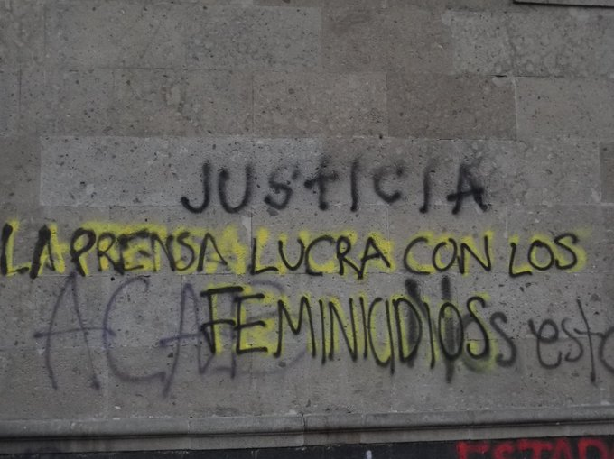
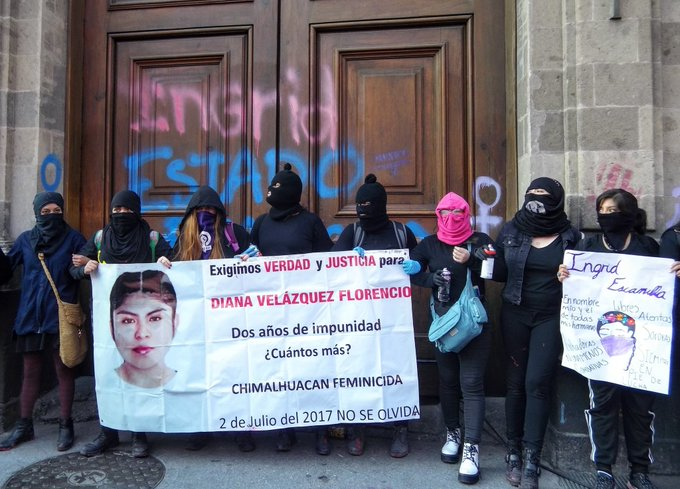
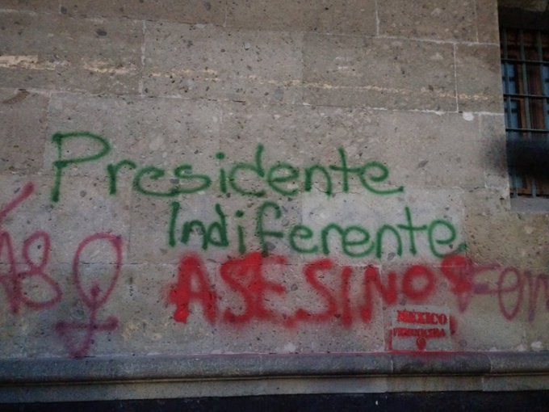
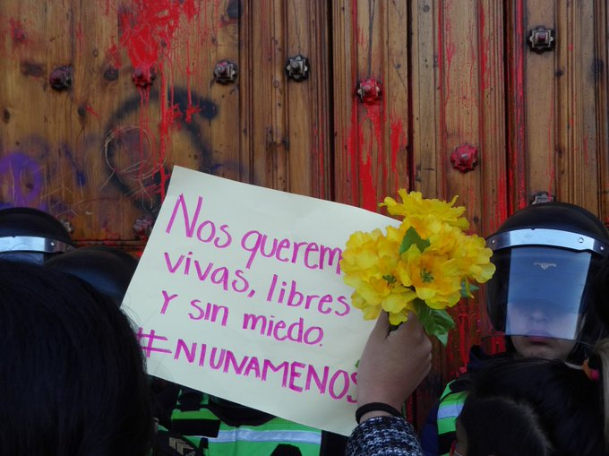
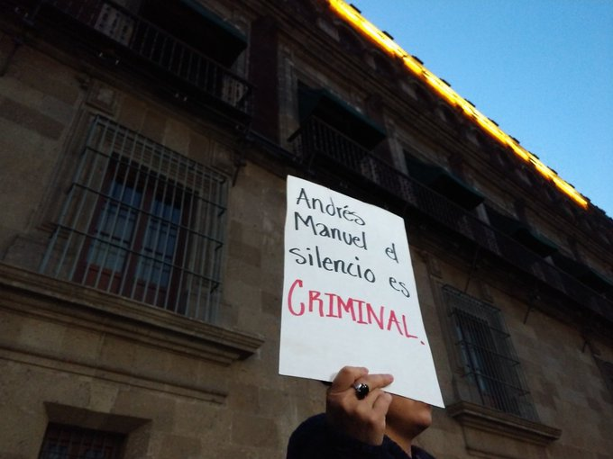

 ##  El gobierno
Este es el comunicado del 4 de febrero del que la prensa dijo que se eliminaba el feminicidio, porque eso aparentaba. [Ver original aquí]([https://link](https://www.gob.mx/fgr/prensa/comunicado-fgr-033-20-fgr-informa))

Lo que entiendo que dice el texto: el feminicidio pasa automáticamente de 40 a 70 años de pena.

Y que todo homicidio contra la mujer se califica automáticamente como feminicidio.

Actualmente, todo homicidio contra la mujer se cataloga como homicidio y debe INVESTIGARSE primero como feminicidio (aunque no ocurre así) y de cumplirse 7 criterios, se procede a catalogarlo como feminicidio. En esa parte, es donde autoridades a menudo fallan por complicidad o pereza o incompetencia.
 
Por eso, es al rededor del segundo punto donde debió existir el debate, pues no quedaba claro si automaticamente todos los homicidios contra la mujer iban a PERMANECER como feminicidios, o se calificaba así automáticamente y DESPUÉS si el acusado se defendía podía re-tipificar a homicidio y cambiar su condena, algo así como que la chamba que alguien no quiere hacer y la incompetencia, ahora estuvieran del lado de las víctimas (y contra la presunción de inocencia, pero ese es otro cantar).

Es ahí donde debió ocurrir el debate y la búsqueda... pero la prensa mexicana, los medios culeros que sólo buscan clics y la gente que le tiene odio (merecido o no) al presidente, decidieron que era buena idea gritar que se querían eliminar los feminicidios. 

## Los buitres
Después, el día 10, llegó esta discusión al sitio donde el presi hace gala de aprovecharse de las confusiones para controlar la conversación y dijo: no quiero que "lo del" (o sea, la mentira) feminicidio se lleve la nota.

Sin embargo, del dicho anterior por el presi, se corrieron videos mezclándolo como si hablara directamente de todos, o de uno de los 10 feminicidios diarios de este país. Porque así es este país, y en un país donde este infierno ocurre, hay que tratar la palabra **feminicidio** con mucha atención porque es muy probable que simplemente al decirla, estén matando a otra mujer.

## Las feministas
Tras el feminicidio, Ingrid Escamilla no sólo fue ultrajada por su asesino, sino también por [policías ministeriales](https://www.jornada.com.mx/ultimas/politica/2020/02/13/investiga-segob-filtracion-de-imagenes-de-ingrid-escamilla-5050.html), o reporteros, que filtraron las fotografías de la escena del crimen para alimentar a el morbo de la gente que se considera normal. Para combatir esto, una tuitera feminista propuso la alterar la indexación para hacer difícil este trabajo al utilizar las palabras clave relacionadas al caso de Ingrid Escamilla. Esto ayudó al menos, para que usuarios no vieran por accidente el cuerpo revictimizado y cuidarla de los buitres.

||
-|-|
 |  |
 | _fotos tras buscar Ingrid Escamilla en tuiter_ |

Hoy, 14 de Febrero, mientras el presidente da su típica conferencia de prensa de las mañanas, afuera del palacio nacional se manifestan contra él con justa razón.

. | | |
-|-|-|
 |  |  |    
 |  | Fotos por [Abismada](https://twitter.com/abismada_ ) |
|||

Mientras estas manifestaciones ocurrían fuera de palacio nacional, el presidente ocurrió decir que no hay malestar social... que son los grupos de poder los que se resisten a los cambios. Otra vez, llevando el tema a su discurso donde él es el paladín de la honestidad y que la honestidad suya salvará a todos. 

[Frida Guerrera](https://fridaguerrera.blogspot.com/), **pacientemente, reconociéndole su perfil de luchador social, corrigiéndolo y advirtiéndole que no cambiara el tema, y que la violencia contra las mujeres _no es igual y merece atención especial_, le preguntó qué está haciendo este gobierno y por la fiscalía especializaad en feminicidios**, y AMLO habló de estar trabajando todos los días, a su favor, dijo haberse opuesto a la eliminación del feminicidio como tipificación... y que tiene la conciencia tranquila... pero cerró con diez puntos improvisados que resumo así:

> 1) No
> 2) en
> 3) tien
> 4) do.
> 5) Ser
> 6) malo 
> 7) está 
> 8) mal.
> 9) ¿YA?
> 10) ¿¿Así??

Muchos empleados de gobierno replicaron el decálogo como documento oficial de las cuentas oficiales... Ninguno pudo defenderlo. 

Tras las manifestaciones, el gobierno de Claudia Scheinbaum, alias: el gobierno que desapareció el cuerpo de granaderos, dejó salir a un cuerpo que parecían granaderos, sonaban como granaderos y golpeaban como granaderos... hasta gas tiraban.

## Luchador social 
### (pero principalmente: hombre)

Y bueno, este tema me generó programar este blog, y comencé a escribirlo desde el día 12... Y entre el lunes y el viernes, se manejó mucho la desinformación de que el presidente había desestimado el tema de los feminicidios al decir que le afectaban a su rifa... o que ya se había hablado mucho de ese tema... cosa que no fue cierto, sin embargo, con lo ocurrido hoy 14, es imposible defenderlo porque hoy sí la cagó. Yo estuve corrigiendo y discutiendo en internet sobre ese tema. Pocas veces me arrepiento de algo.

 Andrés Manuel López Obrador a menudo saca sus credenciales de llevar en "la lucha" más de 40 años: "desde que salí de la escuela" dice. Y no miente. Se vale considerarse luchador social antes que servidor público y antes que político. Pero hoy demostró que antes de ser eso, es un hombre que no se ha detenido a tratar de entender que el lugar de un presidente frente al feminismo es no estorbar, y su decálogo, estorba. En fin, _no entiende que no entiende_.

 Ya veremos con qué sale el lunes... pues esta es una situación en progreso.
 